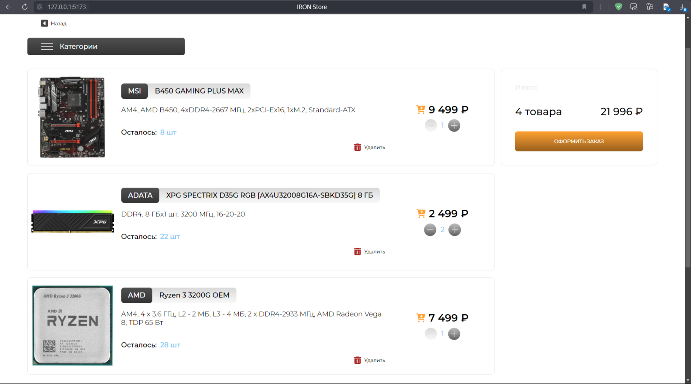

# IRON Store
MVP интернет-магазина комплектующих для PC

<br>

## Клиент

* React (TypeScript)
* MobX (хранилища, взамен Reduce)

<br>

## Сервер

* Express (TypeScript)
* MongoDB (без ORM, только драйвер)

<br>

## Запуск dev-версии:

Подготовка данных:
```bash
sudo systemctl start mongod
mongosh -f "data/db-bootstrap.js"
```

Старт сервера:

```bash
cd server && yarn dev
```

Старт клиента:

```bash
cd client && yarn dev
```

<br>

## Снимки экранов
### Главная старинца


### Категории товаров


### Страница товара


### Добавление товара в корзину


### Корзина товаров



### Оформление заказа


### Регистрация пользователя


### Вход в личный кабинет


### Личный кабинет


